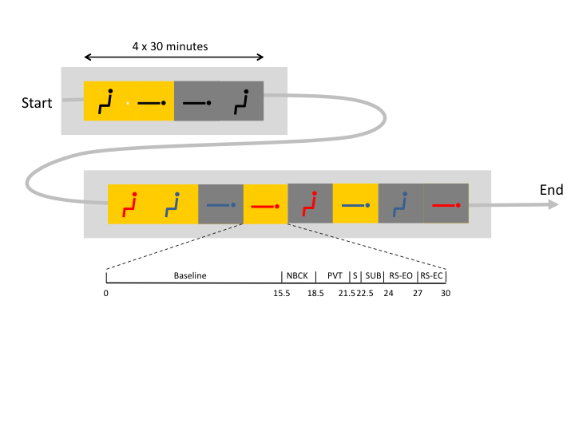

batman
======

This repository contains the code and instructions necessary to reproduce
the data analyses of the [STW][stw]-funded project [BATMAN][batman].

In the documentation that follows we will assume a Linux-like OS, and that
the BATMAN dataset is managed by [somsds][somsds] data management system.
This is the case if you are trying to reproduce the data analyses at
the `somerengrid` (our lab's private computing grid).

A large sample of this documentation is taken from the [meegpipe tutorial][tutorial], but 
updated to reflect any changes that have occured since that tutorial was written.
The tutorials are worth reading if you wish to get a better understanding of the scripts 
in this repository. 

[somsds]: https://germangh.com/somsds
[batman]: http://www.neurosipe.nl/project.php?id=23&sess=6eccc41939665cfccccd8c94d8e0216f
[stw]: http://www.stw.nl/en/
[tutorial]: https://github.com/meegpipe/meegpipe/tree/master/tutorials

## Experimental (lab) protocol

In a nutshell, the laboratory protocol involved various environmental manipulations
(posture, skin temperature, ambient light) that are expected to trigger
relevant thermoregulatory system responses as well as to have profound effects on alertness. 
Such responses were characterized using a diverse set of variables: arterial blood pressure, 
ECG, skin and core temperature, and [hdEEG][wikieeg]. In order to assess effects on behavior and alertness, the
subjects performed an auditory [2-back][wikinback] task, an auditory [psychomotor 
vigilance task][wikipvt], a saccade test, answered subjective questions on fatigue and effort to 
perform these tasks, and eyes-open and eyes-closed resting-state all while being subjected 
to these experimental manipulations.
In total there were 12 experimental blocks, as illustrated in the diagram below:

[wikieeg]: http://en.wikipedia.org/wiki/Electroencephalography
[wikinback]: https://en.wikipedia.org/wiki/N-back
[wikipvt]: https://en.wikipedia.org/wiki/Psychomotor_vigilance_task

Note that each __experimental block__ consisted of seven __sub-blocks__:
A __baseline__ sub-block when the subject was instructed to simply wait with
her eyes open, a __nback__ sub-block that involved an auditory 2-back working memory task,
a __pvt__ sub-block that involved a simple reaction-time task, a __saccade__ sub-block that involved
tracking a horizontally moving dot with the eyes, a __subj__ sub-block that contained the 
subjective questions, a __rs-eo__ sub-block when the subject stared at a cross hair, and a
__rs-ec__ sub-block when the subject rested with the eyes closed.

The __nback__, __pvt__, __rs-eo__ and __rs-ec__ all lasted 3 minutes. The __saccade__ sub-block lasted 1 minute.
The __subj__ had variable duration depending on how fast the questions were answered.

## What have we done with the BATMAN dataset?

The table below lists all the analyses and processing tasks that have been or will be 
performed on the BATMAN dataset, roughly in chronological order.

What?                                                 | Documentation
----------------------------------------------------- | -------------
Data splitting                                        | [+btmn/+split_files/README.md][split]
Pre-processing                                        | [+btmn/+preproc/README.md][preproc]
Extraction of temperature values                      | [+btmn/+temp/README.md][temp]
Extraction of N-Back ERPs                             | [+btmn/+nback/README.md][nback] 
Extraction of PVT ERPs                                | [+btmn/+pvt/README.md][pvt]
Extraction of resting state power features            | [+btmn/+features/README.md][features]
Extraction of heart rate variability (HRV) features   | [+btmn/+features/README.md][features]
Extraction of arterial blood pressure features        | [+btmn/+abp/README.md][abp]
Statistical analysis of effects on EEG power features | [+btmn/+stats/README.md][stats]

[split]:    ./+btmn/+split_files/README.md
[preproc]:  ./+btmn/+preproc/README.md
[temp]:     ./+btmn/+temp/README.md
[nback]:    ./+btmn/+nback/README.md
[pvt]:      ./+btmn/+pvt.README.md
[features]: ./+btmn/+features/README.md
[stats]:    ./+btmn/+stats/README.md
[abp]:      ./+btmn/+abp/README.md
